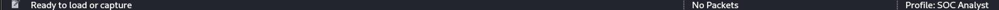
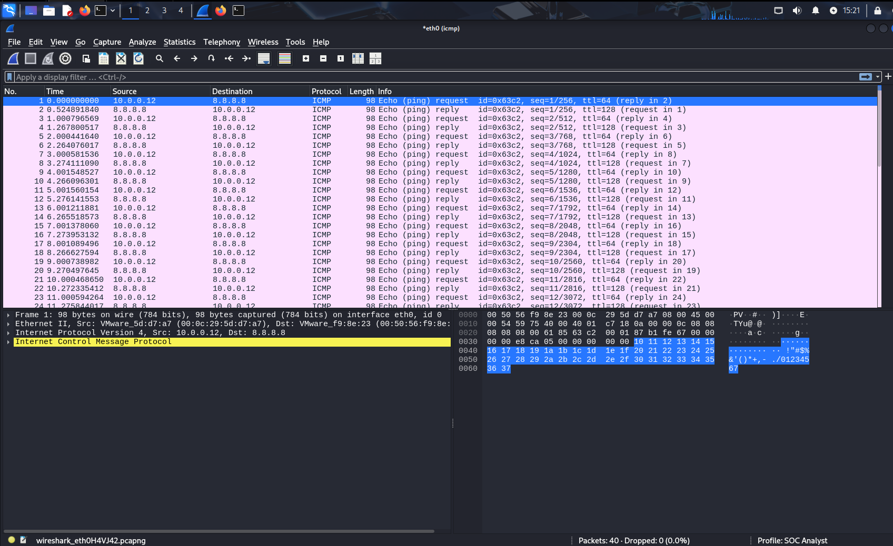
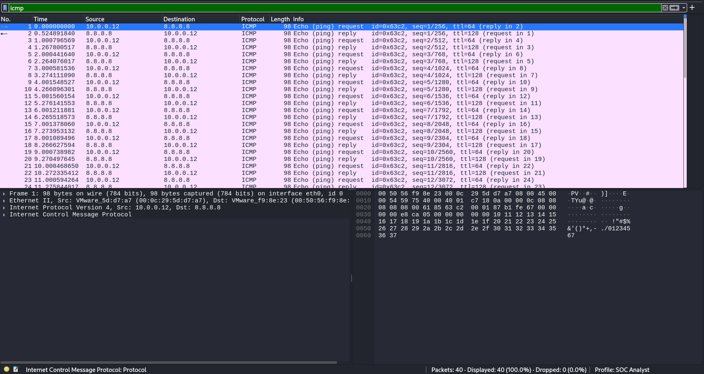

# 🕵️ Day #6: Introduction to Wireshark – Packet Analysis for SOC Analysts

## 🎯 Objective

The objective of this lab is to introduce Wireshark, a powerful network protocol analyzer. This lab simulates basic SOC (Security Operations Center) analyst tasks such as identifying ICMP traffic, applying capture/display filters, and creating a custom analyst profile.

---

## 🛠️ Lab Setup

| Component        | Details                                      |
|------------------|----------------------------------------------|
| OS               | Kali Linux / Ubuntu / Windows / macOS        |
| Tool Used        | Wireshark (Latest Stable Version)            |
| Network Adapter  | Required (must support monitor mode if needed) |
| File Type        | Live capture or PCAP file                    |

---

## 📥 Installation

Download Wireshark from [https://www.wireshark.org/download.html](https://www.wireshark.org/download.html)  
Install with default settings. Ensure `Npcap` is installed (on Windows) or Wireshark group permissions are set (Linux).

---

## 📸 Screenshots

| Task | Screenshot |
|------|------------|
| ✅ Created new profile: `SOC Analyst` |  |
| ✅ Capture Filter: `icmp` |  |
✅ Display Filter: `icmp` |


---

## 🔍 Filters Used

### 🎯 Capture Filter
icmp
```bash
This filter was applied **before** the packet capture to only collect ICMP traffic (e.g., ping requests/replies).
```
### 🎯 Display Filter
icmp
```bash
This filter was applied **after** the capture to narrow the visible traffic down to ICMP packets.

```
## 👨‍💻 Commands (Optional Testing)
Use this command on a second machine or terminal to generate ICMP traffic:
```bash
ping 8.8.8.8
```
## 🧠 Observations & Learnings
✅ Observations:
- ICMP traffic is easy to isolate using both capture and display filters.

- Wireshark provides real-time insight into packet-level network activity.

- Creating a custom profile (SOC Analyst) helps segment use-cases and preferred layouts.

## 🧠 Learnings:
- Display filters are non-destructive and flexible—useful for forensic investigations.

- Capture filters are faster and reduce noise—but cannot be changed mid-capture.

- The combination of filters + profile configuration sets the foundation for SOC-level monitoring and triage.

- Analyzing ICMP echo requests/replies gives a foundation for understanding more advanced protocols like TCP and DNS later.
